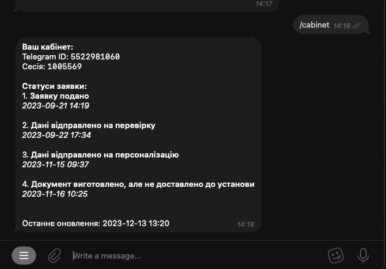

# 0.1.2
- Added `/dump` `/time` `/ping` commands to the commands of the bot.
- Added `/version` command and versioning of the bot.
# 0.1.1
- Added rate limit
- Added subscription on many applications via 1 command

- New `/dump` command which dumps all data from DB about subscriptions and applications

# 0.1.0
- Added QR-code scanner:

