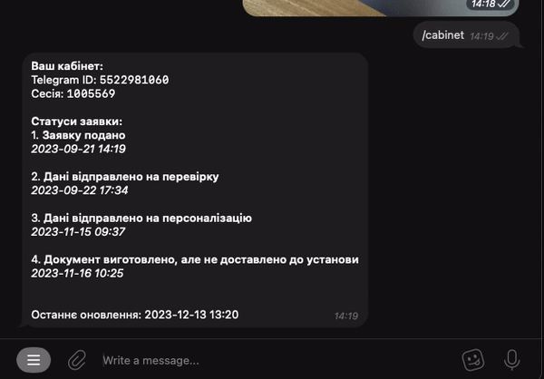

# 1.0.0

- Compare: [`main@7f85cc7` → `dev@390707a`](https://github.com/mrAlexZT/passport-status-bot/compare/7f85cc7...390707a)

## Highlights
- Modularized bot architecture with centralized command registry and user management
- Playwright integration and improved HTTP handling with timeouts, proxy support, and fallbacks
- Admin UX: antiflood bypass for admins and clearer error visibility
- Dynamic versioning: latest GitHub release info for the `/version` command
- Improved QR detection and image processing
- Robust logging across scraper, middleware, and core workflows

## Added
- Enhanced scraper and Playwright logging, error handling, and timeout management
- Secure token retrieval (unwrap `SecretStr` safely)
- Admin bypass for antiflood middleware
- Safe user ID extraction and improved event handling in `LoggerMiddleware`
- Status update formatting and subscriber notifications
- Dependencies: `requests`, `types-requests`, `opencv-python`, `numpy`

## Changed
- Extensive type hints and readability improvements across modules
- Unified logging patterns and centralized messaging/text formatting
- Ruff configuration updates; use of built-in generics/`Union` syntax
- QR detection pipeline streamlined; image-processing logic refined
- Packaging: migrated `pyproject.toml` to PEP 508 style and reworked dependency layout

## Fixed
- Corrected `set_my_commands` parameter usage
- Admin commands now use `pymongo` collection retrieval consistently
- Timezone-aware datetimes across models and tests
- Async wrapper for scheduler job; tests refactored to use `AsyncMock`
- Numerous safety/robustness fixes in error logging and exception handling

## CI/CD and Tooling
- Dockerfile: Python 3.12 base; simplified Playwright install; leaner font setup
- Pre-commit and ruff updates; removed redundant hooks; clearer naming
- CI caching and workflow reorganization for faster builds
- mypy updates and config refinements (including third-party stubs)

## Docs
- Expanded `README.md` with feature set, architecture overview, and deployment notes

## Migration Notes
- Review DB indexes: `telegram_id` index removal in models may affect queries
- Ensure new dependencies are installed (`opencv-python`, `numpy`, `requests`, stubs)
- Docker consumers should rebuild with Python 3.12 base image

# 0.2.1

- Added `/authors` command with detailed information about:
    - Project authors and contributors
    - Contact information and social links
    - Project details and technical stack
    - Improved formatting and organization
- Added "Command not found" handler with helpful `/help` suggestion
- Added proper error logging for notification sending
- Improved version handling with better error messages
- Fixed Markdown formatting in various messages

# 0.2.0

- Added admin commands and improvements:
    - `/users` - List all users and their subscriptions with detailed statistics
    - `/cleanup` - Remove invalid data from database with interactive confirmation
    - Added inline buttons for safer database operations
    - Added multi-stage data validation and progress tracking
    - Improved admin permission checks for both commands and callbacks

- Database improvements:
    - Added cleanup for users without telegram_id
    - Added cleanup for users with invalid session_id
    - Added cleanup for subscriptions without telegram_id
    - Added cleanup for subscriptions without session_id
    - Added cleanup for orphaned subscriptions
    - Added data integrity validation
    - Added statistics tracking for invalid records

- User Interface improvements:
    - Added progress indicators for long operations:
        - "🔍 Аналіз бази даних..."
        - "⏳ Аналіз даних..."
        - "🗑 Видалення даних..."
    - Added detailed statistics in user lists
    - Added confirmation buttons with clear actions
    - Added operation cancellation support
    - Added Markdown formatting for better readability
    - Added proper error messages with emoji indicators

- Error handling and safety:
    - Added stale data detection
    - Added operation cancellation support
    - Added safe message editing with fallbacks
    - Added detailed error logging
    - Added validation before destructive operations
    - Added proper error messages for all failure cases
    - Added permission checks at multiple stages

- Code quality improvements:
    - Centralized all message constants
    - Split large functions into smaller, focused ones
    - Added proper type hints and validation
    - Improved function documentation
    - Added consistent error handling patterns
    - Added unified logging format
    - Added reusable utility functions:
        - Message editing utilities
        - Permission checking utilities
        - Data validation utilities
        - Progress tracking utilities

# 0.1.2

- Added `/dump` `/time` `/ping` commands to the commands of the bot.
- Added `/version` command and versioning of the bot.

# 0.1.1

- Added rate limit
- Added subscription on many applications via 1 command
  

- New `/dump` command which dumps all data from DB about subscriptions and applications
  

# 0.1.0

- Added QR-code scanner:

