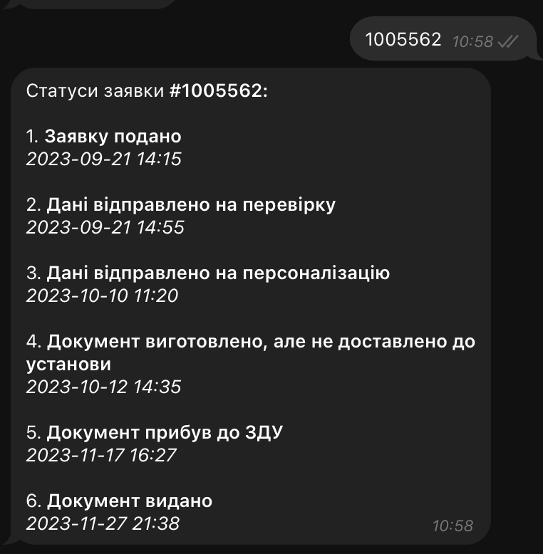
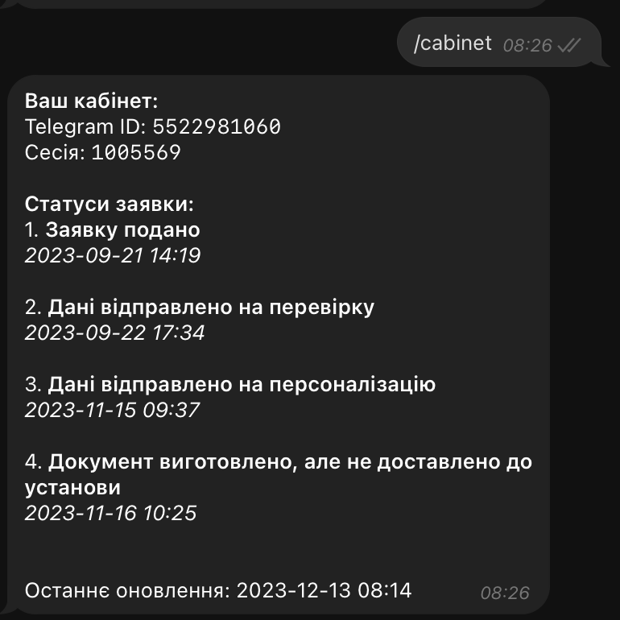
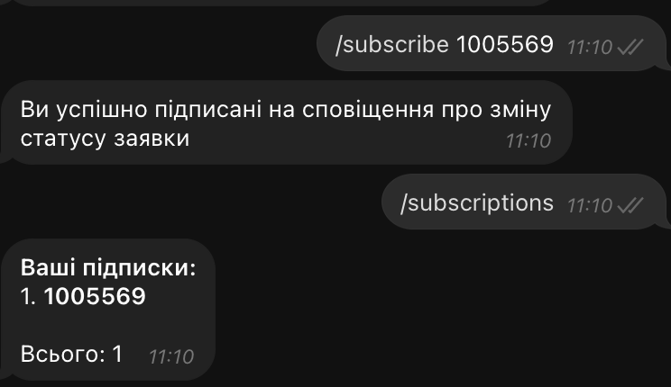
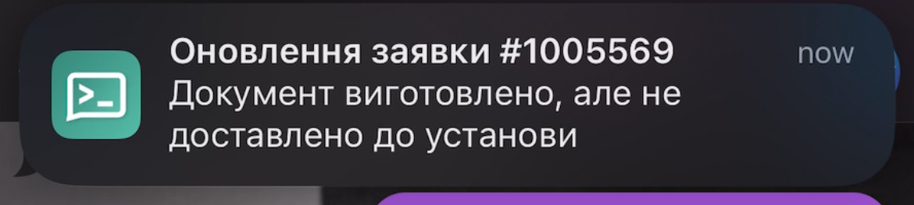
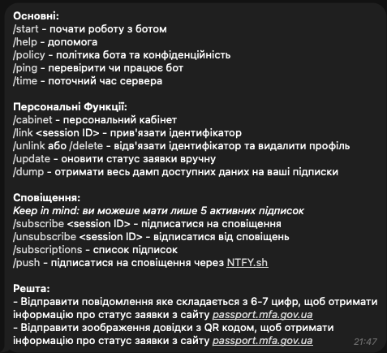

# MFA Passport Dashboard bot
<p align="center">
   <a href="https://t.me/passport_mfa_gov_ua_bot"></a> <br>
   Telegram bot with useful tools for the community | Click to visit in real time.
</p>

# Важливе повідомлення
### Станом на 28 Січ 2024
Я помітив деяку активність репозиторія та боту, проте отримав свій паспорт досить давно, це робить підтримку бота не необхідною для мене і здебільшого марна трата ресурсів, отож підтримки рантайму самого бота в тг не буде, але ви завжди можете selfhostʼити чи забрати АПІ та використовувати у своїх проектах.


###  Станом на 18 Серп 2025 
Проект був вдосконалений користувачем mrAlexZT.
- Форк проекту: https://github.com/mrAlexZT/passport-status-bot  
- Сам бот у Telegram: @passport_mfa_gov_ua_check_bot

Я рекомендую цю оновлену версію, оскільки вона містить деякі покращення, хоч і не змінює основний функціонал боту. Однак, хочу підкреслити, що **я не маю жодного відношення до цього бота, його розробника (mrAlexZT) чи будь-яких подальших\зроблених змін.**  
Усі питання, пов'язані з роботою бота, його функціоналом або усуненням проблем, слід адресувати **безпосередньо автору форку** хоч я і є розробником основного функціоналу.

PR завжди відкриті :)  
## Actual Demo (NOT!)
> [Note] Click on image.  

<a href="http://www.youtube.com/watch?feature=player_embedded&v=vtffijuUg5Y" target="_blank"></a>

Цей бот повідомляє про зміни статусу вашої заявки на _passport.mfa.gov.ua_ та надає можливість відстежувати її статус, оскільки МЗС не забезпечує такої можливості, чим створює незручності.  
А саме те що потрібно вручну перевіряти кожного часу коли є можливість, щоб знати що хоч щось змінилося.  

На даний момент бот надає можливості:
- Перевіряти статус заявки за простим надсиланням номера заявки, наприклад "1005562"  

   

- Створення власного кабінету:
    - Прив'язка заявки до кабінету
    - Швидкий доступ до статусу заявки через кабінет    

  

- Відстеження змін статусу через підписку (макс 5 підписок.)  


  

- Пуш-повідомлення про зміну статусу заявки (працює тільки для підписок через NFTY.sh)

  

- Повний перелік команд бота:

  

## ToDo
- [x] Перевірка статусу заявки
- [x] Перевірка статусу заявки через кабінет
- [x] Підписка на зміни статусу заявки
- [x] Підписка на зміни статусу заявки через кабінет
- [x] Push-повідомлення про зміну статусу заявки
- [x] Refactoring
- [x] Docker-compose
- [x] Readme.md
- [x] QR-code scanner
- [ ] Analytics
- [x] Rate limit
- [ ] Inline buttons
- [ ] Improved structure
  - [ ] Middlewares

## Changelog
[CHANGELOG.md](CHANGELOG.md)
## Installation
### Clone Repo
```bash
git clone https://github.com/denver-code/passport-status-bot
cd passport-status-bot
```
### Environment variables
Rename `example.env` to `.env` and fill it with your data.
```bash
cp example.env .env
vi .env
```
### Docker-compose
```bash
docker-compose up -d
```
### Manual
```bash
poetry install
poetry shell
python main.py
```
### Edit in VSCode
```bash
poetry install
poetry shell
code .
```
Then select interpreter in VSCode: `Ctrl+Shift+P` -> `Python: Select Interpreter` -> `Poetry Environment` or something like that.

## License
[MIT](LICENSE.md)
